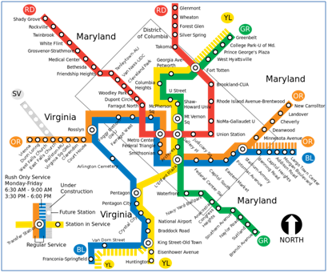
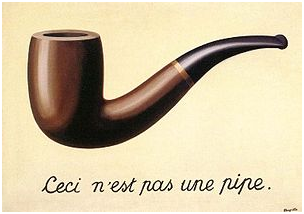

Abstraction
-----------

This is a test.

Dealing with Complexity

The world is complex and people often form simplified representations of real world artifacts and phenomenon to help cope with their complexity. These simplified representations focus on the essential aspects of something and ignore or conceal less important or non-essential aspects.  The simplification reduces the complexity to a level where understanding, explanation, expression, planning, analysis or manipulation can take place. What is essential or not essential to a simplified representation depends on the purpose or goal that one has in mind. Just as "Beauty is in the eye of beholder" so also "what is essential is in the purpose of the user." A simplified representation made for one purpose may be useless for another purpose. 

People use simplified representations in everyday life. Maps are a good example. The map of the Washington D.C. Metro system (see the following image) is a simplified representation of the actual, more complex reality that forms the "real world" transportation system. This is a simplified representation designed to help travelers plan and complete a journey on the transportation system from a starting station to and destination station. It is a simplified representation because it deliberately does not include a great deal of the complexity of the actual Metro system. For example, the map does not include facts about schedule or cost, it does not give the location of any station, it does not shown which parts are above ground and which are below ground, and it does not show the interior layout of the train cars. You can easily think of many other things about the Metro system that the map does not show. However, the map serves a useful purpose -- navigating between stations -- and the simplification is critical to serving this purpose. Of course, it is not useful for other purposes. For example, the map is not drawn to scale so it is not useful to the task of figuring out how much track is needed between two stations. You can likely think of other tasks for which this map is not useful. 

The relationship between a real artifact and its simplified representation is illustrated in a painting by Rene Magritte done in the late 1920s. This painting is shown in the following image. The painting, titled the Treachery of Images, (Figure 2) depicts a smoking pipe and has the seemingly contradictory caption painted by Magritte that is French for "This is not a pipe." Magritte is quoted as saying about this painting that:
 
"The famous pipe. How people reproached me for it! And yet, could you stuff my pipe? No, it's just a representation, is it not? So if I had written on my picture "This is a pipe", I'd have been lying!

Torczyner, Harry. Magritte: Ideas and Images. p. 71.

Of course, Magritte is correct that the painting of a pipe is not the same as the actual pipe; it is merely a simplified representation of a pipe. It is a simplified representation because it includes some of the properties of the real pipe (shape, appearance) but the painting does not show the actual dimensions of the pipe, what it is made of, what it weighs, etc. 

Summary: 
Simplified representations are used to reduce the complexity of an entity so that it can be worked with more easily.
